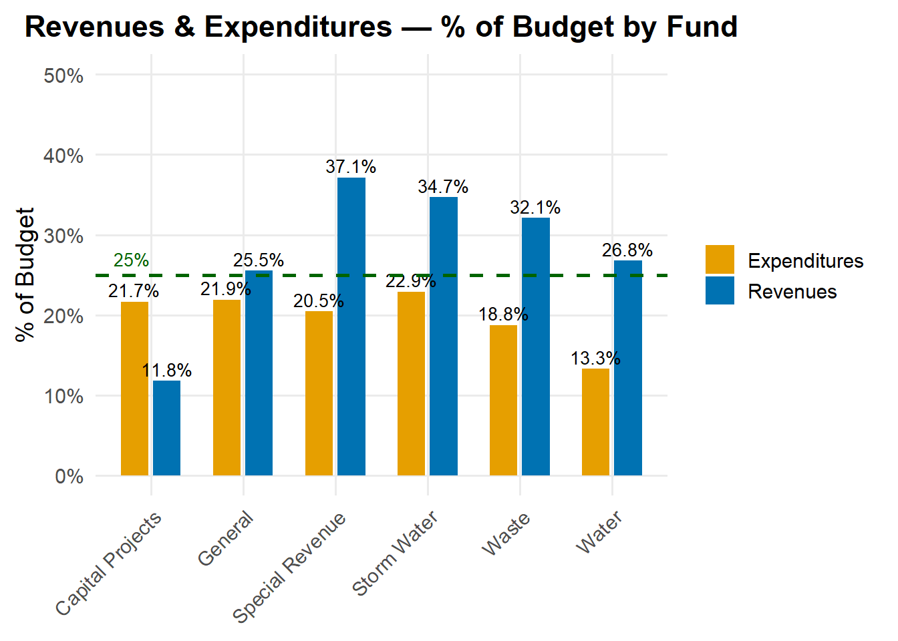
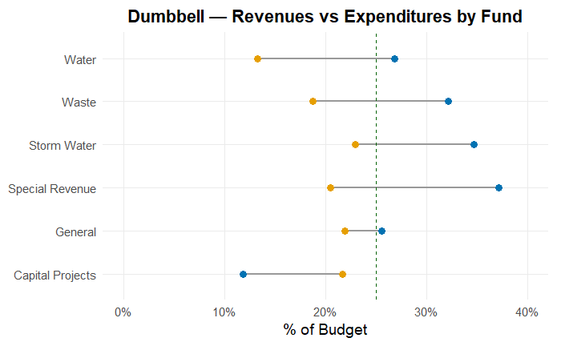
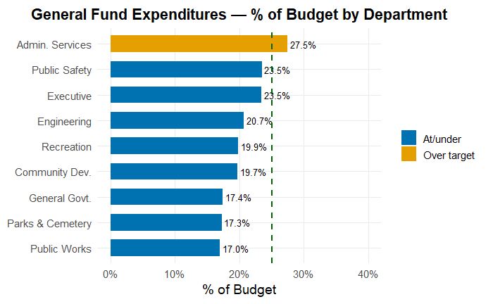

# Municipal Financial Analytics

This repository showcases applied financial analytics workflows used to evaluate
municipal fiscal trends and support executive-level decision-making.

The focus is on reproducible reporting, data visualization, and transparent
analytical methods using R and Quarto.

## Topics Covered
- Financial health indicators
- Budget trend analysis
- Public sector data visualization
- Reproducible reporting

## Status
Project structure in progress — additional analysis and documentation coming soon.

## Example Outputs

### Revenue Trends

### Expenditure Trends

### Fund Balance Trends

