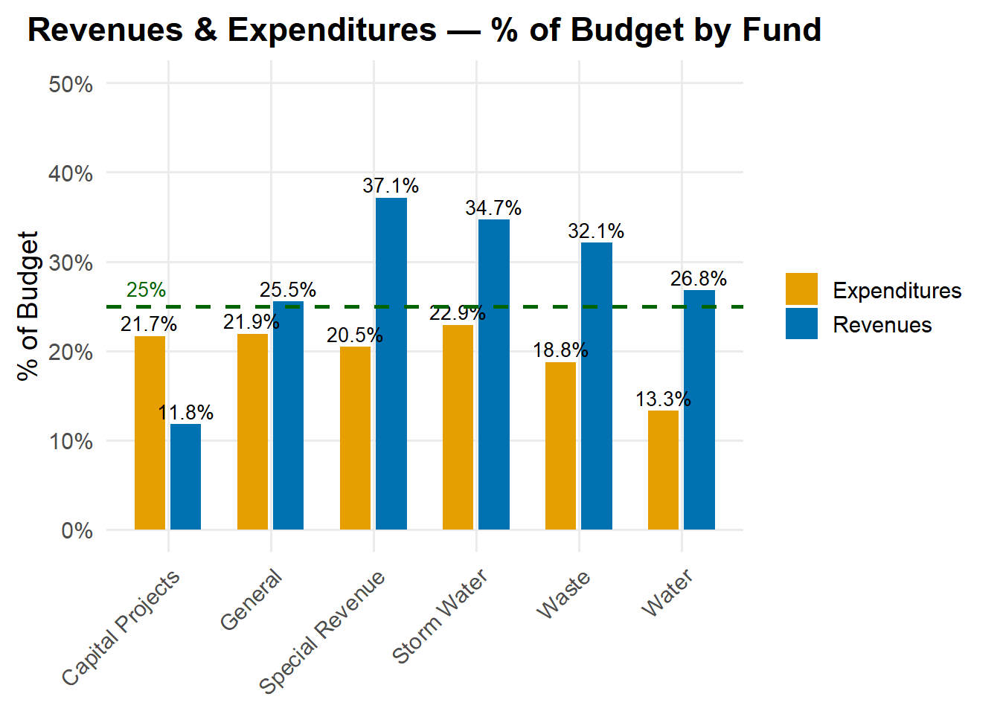
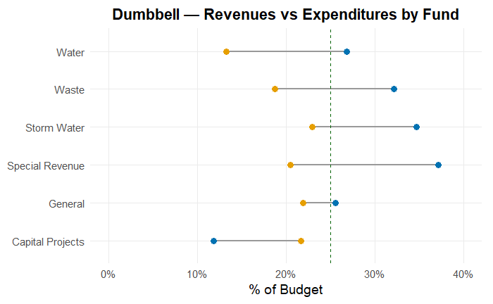
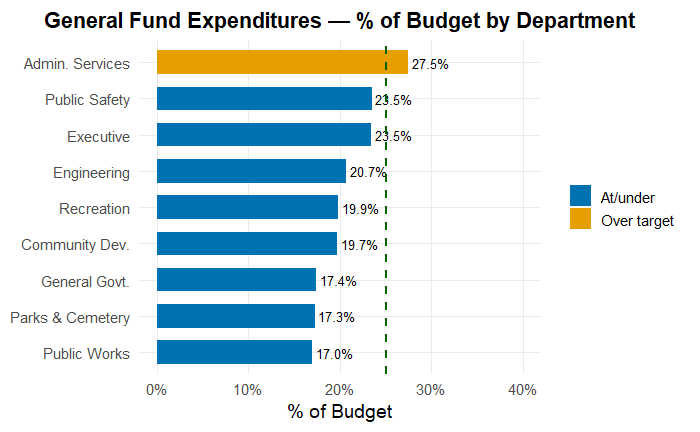

# Municipal Financial Analytics

This project analyzes municipal revenue, expenditures, and fund balance trends to evaluate fiscal health and long-term sustainability.

Using real-world public finance data, the analysis examines revenue stability, expenditure growth patterns, and structural balance indicators to support executive-level and council decision-making.

The workflow emphasizes reproducibility, transparency, and communication—transforming raw financial data into policy-relevant insights using R and Quarto.

## Why This Matters

Municipal governments operate under balanced budget requirements and long-term fiscal constraints. Small structural imbalances, if undetected, can compound into significant risks.

This analysis framework helps identify:
- Revenue growth volatility
- Structural deficits
- Fund balance sustainability
- Long-term expenditure pressures

The goal is not just reporting—but risk identification and decision support.

## Project Context

This project demonstrates an applied municipal finance analytics workflow used to evaluate fiscal trends and communicate insights to executive leadership. 

The analysis focuses on transforming raw financial data into clear visualizations and executive-ready reporting, bridging technical analysis with public-sector decision-making.

## Key Findings

- Revenue growth has been uneven across major categories, increasing exposure to cyclical volatility.
- Expenditure growth trends suggest pressure on long-term structural balance.
- General Fund balance levels remain within policy thresholds but show sensitivity to expenditure growth assumptions.
- Visual trend analysis improves clarity for non-technical stakeholders.

## Analytical Components

- Multi-year revenue and expenditure trend analysis
- Structural balance evaluation
- General Fund sustainability assessment
- Executive-ready financial health indicators
- Reproducible reporting workflow using Quarto

## Example Outputs

### Revenue Trends

### Expenditure Trends

### Fund Balance Trends

